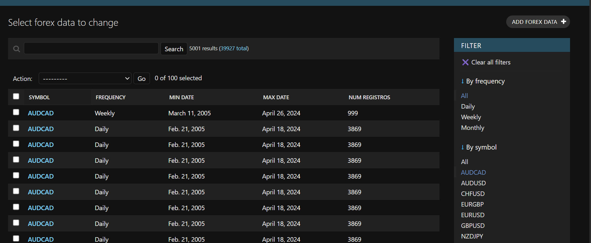
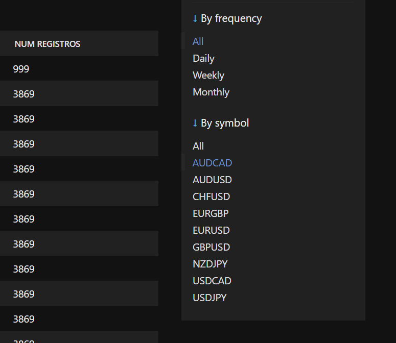
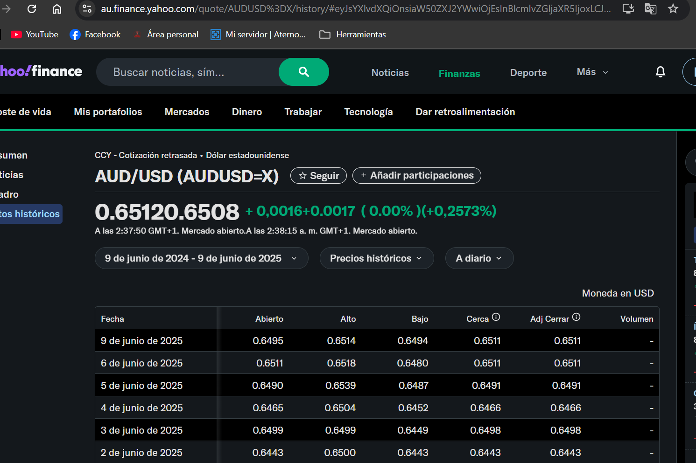
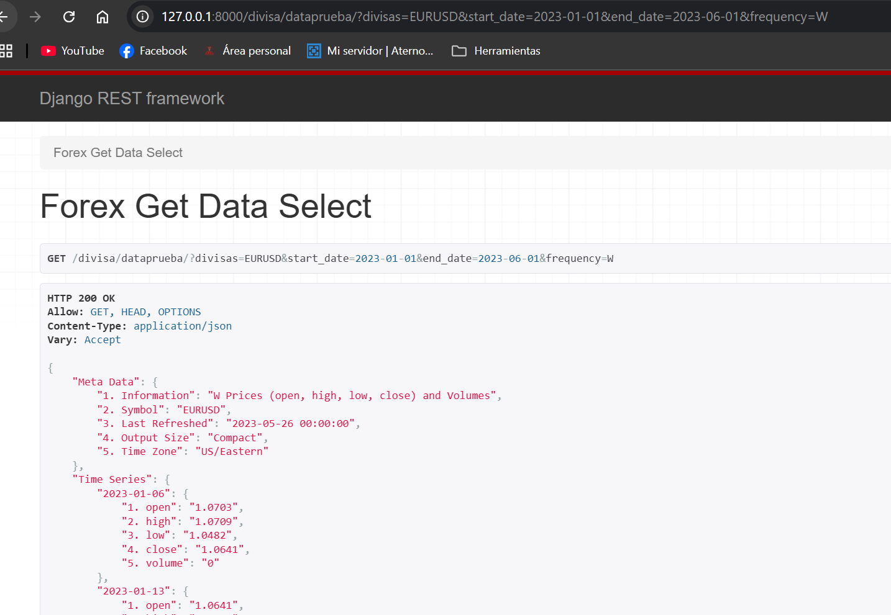

# 📈 ForexRadar Backend

<div align="center">


**Robust REST API for Forex market analysis with dynamic scraping and historical data**

[🚀 Demo](#-preview) • [📖 Documentation](#-main-features) • [⚡ Installation](#️-quick-installation) • [🔗 Frontend](https://github.com/Dionisio202/ForexRadar-frontEnd)

</div>

---

## 🎯 What is ForexRadar?

**ForexRadar** is a powerful backend application built with **Django REST Framework** that combines intelligent scraping and APIs to provide comprehensive Forex market data. Designed to power analytical dashboards and trading applications with accurate and up-to-date information.

### ✨ Key Features

- 🔄 **Real-time data** with current prices and variations
- 📊 **Intelligent scraping** from Yahoo Finance with Selenium
- 💾 **Historical database** from 2005 to present
- 🎛️ **Complete administration panel** fully customizable
- 👥 **User management** with favorite currencies
- 📈 **Multiple frequencies** (daily, weekly, monthly)

---

## 🖼️ Preview

<table>
<tr>
<td width="50%">

### 🎛️ Administration Panel


</td>
<td width="50%">

### 🔍 Advanced Filters


</td>
</tr>
<tr>
<td width="50%">

### 📋 Scraping Results


</td>
<td width="50%">

### 🌐 Yahoo Finance Data


</td>
</tr>
</table>

---

## 🚀 Main Features

<table>
<tr>
<td width="50%">

### 📊 **Market Data**
- ✅ Real-time prices
- ✅ Complete historical data
- ✅ Multiple currency pairs
- ✅ Customizable frequencies

</td>
<td width="50%">

### 🛠️ **Management & Admin**
- ✅ Django administration panel
- ✅ Advanced filters by symbol/date
- ✅ Authenticated user management
- ✅ Favorite currencies configuration

</td>
</tr>
</table>

---

## ⚙️ Technology Stack

### 🔧 Backend Core
```
Django 4.2.22          # Robust web framework
Django REST Framework  # Powerful REST API
SQLite3               # Database (development)
```

### 🕷️ Scraping & APIs
```
Selenium              # Web automation
BeautifulSoup         # HTML parsing
Alphavantage API      # Alternative data
```

### 🎨 Frontend (Separate repository)
```
React                 # User interface
ApexCharts           # Candlestick charts
```

> 🔗 **Frontend Repository:** [ForexRadar-frontEnd](https://github.com/Dionisio202/ForexRadar-frontEnd)

---

## 🗄️ Data Structure

### 📈 `ForexData` Model
```python
class ForexData(models.Model):
    symbol      # Currency pair (EURUSD, AUDUSD, etc.)
    date        # Record date
    open_price  # Opening price
    high_price  # Maximum price
    low_price   # Minimum price
    close_price # Closing price
    volume      # Traded volume
    frequency   # Frequency (D, W, M)
```

### 💱 `Divisa` Model
```python
class Divisa(models.Model):
    nombre      # Descriptive name
    simbolo     # Currency code
    imagen1     # Main image URL
    imagen2     # Secondary image URL
```

### 👤 `UserDivisa` Model
```python
# User ↔ Favorite Currencies Relationship
class UserDivisa(models.Model):
    user        # Authenticated user
    divisa      # Favorite currency
```

---

## 🎯 Data Coverage

<div align="center">

| 📊 **Metric** | 📈 **Value** |
|:---:|:---:|
| **Available Symbols** | `AUDCAD, AUDUSD, CHFUSD, EURGBP, EURUSD, GBPUSD, NZDJPY, USDCAD, USDJPY` |
| **Time Range** | `2005-02-21` to `2024-04-26` |
| **Frequencies** | `Daily (D)` • `Weekly (W)` • `Monthly (M)` |
| **Total Records** | `190,000+` historical data points |

</div>

---

## 🔍 Scraping System

### 🎯 Main Endpoint: `/divisa/tableData/`

```http
GET /divisa/tableData/?divisas=EURUSD%3DX&period1=2024-01-01&period2=2024-06-01&frequency=1d
```

### 🔄 Scraping Process

1. **🏗️ URL Construction** → Date and frequency parameters
2. **🚀 Headless Selenium** → Automated navigation
3. **📜 Dynamic Scrolling** → Complete data loading
4. **🧹 BeautifulSoup** → HTML parsing and extraction
5. **📤 JSON Response** → Structured data

> ⚠️ **Note:** Scraping depends on Yahoo Finance's current structure

---

## 📡 API Endpoints

### 🔴 Real-time Data
```http
GET /divisa/currentData/?divisas=EURUSD
```

### 📊 Historical Data (Scraping)
```http
GET /divisa/tableData/?divisas=EURUSD%3DX&period1=2024-01-01&period2=2024-06-01&frequency=1d
```

### 💾 Stored Data
```http
GET /divisa/dataprueba/?divisas=EURUSD&start_date=2023-01-01&end_date=2023-06-01&frequency=W
```

### 👤 User Management
```http
POST /user/register/         # Registration
POST /user/login/           # Authentication
GET  /user/getProfile/      # User profile
PUT  /user/updateProfileName/  # Update name
PUT  /user/changePassword/  # Change password
```

### 💱 User Currencies
```http
GET  /divisa/obtenerDivisas/?user=2        # Get favorites
POST /divisa/insertarDivisaInformation/    # Add favorite
DELETE /divisa/eliminarDivisas/            # Remove favorite
```

---

## 🛠️ Quick Installation

### 📋 Prerequisites
- **Python** ≥ 3.9 (recommended 3.11+)
- **Google Chrome** installed
- **Git** for cloning

### 🚀 5-Step Setup

```bash
# 1️⃣ Clone repository
git clone https://github.com/Dionisio202/ForexRadar-backend.git
cd ForexRadar-backend

# 2️⃣ Create virtual environment
python -m venv venv
source venv/bin/activate  # Linux/Mac
# venv\Scripts\activate   # Windows

# 3️⃣ Install dependencies
pip install -r requirements.txt

# 4️⃣ Configure database
python manage.py makemigrations
python manage.py migrate
python manage.py createsuperuser

# 5️⃣ Run server
python manage.py runserver
```

### 🎯 Quick Access
- **API Base:** `http://127.0.0.1:8000/`
- **Admin Panel:** `http://127.0.0.1:8000/admin/`
- **API Docs:** `http://127.0.0.1:8000/api/docs/`

---

## 🚧 Important Considerations

### ⚠️ Technical Limitations
- **Yahoo Finance Dependency:** Changes in their structure may affect scraping
- **Rate Limiting:** Controlled use of scraping is recommended
- **Chrome Driver:** Must be properly installed

### 🔒 Security
- JWT authentication implemented
- Input validation on all endpoints
- CSRF protection enabled

---

## 🛣️ Future Roadmap

### 🎯 Upcoming Features

- [ ] **🤖 Celery Automation** → Periodic scraping
- [ ] **📊 Complete React Dashboard** → Interactive candlestick charts
- [ ] **🔔 Alert System** → Price notifications
- [ ] **🗃️ Data Warehouse** → Production scalability
- [ ] **📈 More Data Sources** → Investing.com


---

## 🤝 Contributing

Want to contribute? Great! 

1. **Fork** the repository
2. **Create** a branch for your feature (`git checkout -b feature/AmazingFeature`)
3. **Commit** your changes (`git commit -m 'Add some AmazingFeature'`)
4. **Push** to the branch (`git push origin feature/AmazingFeature`)
5. **Open** a Pull Request

---

## 🔗 Related Links

- 🎨 **Frontend Repository:** [ForexRadar-frontEnd](https://github.com/Dionisio202/ForexRadar-frontEnd)
- 📚 **Django Documentation:** [docs.djangoproject.com](https://docs.djangoproject.com/)
- 🕷️ **Selenium Docs:** [selenium-python.readthedocs.io](https://selenium-python.readthedocs.io/)

---

<div align="center">

**⭐ If you like this project, consider giving it a star on GitHub ⭐**

*Developed with ❤️ by [Dionisio202](https://github.com/Dionisio202)*

</div>